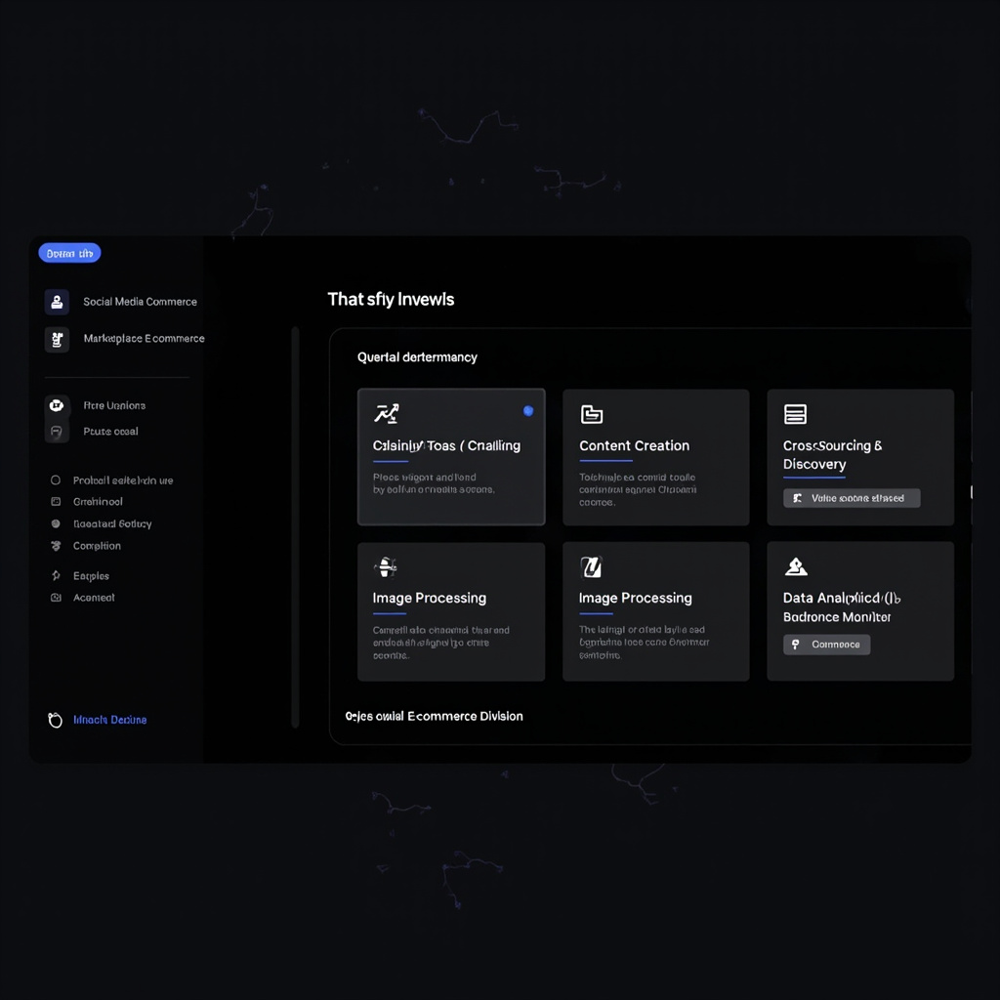

# Ecommerce Agent - 电商全链路运营Agent

> 基于OpenClaw和AI大模型的电商运营自动化工具，支持选品挖掘、内容创作、数据分析、平台上架等完整链路

## 功能演示

### 电商运营控制台


### 功能模块
| 模块 | 功能 |
|------|------|
| 🛒 **选品挖掘** | 低粉爆品挖掘 + 高粉爆品追踪 |
| ✍️ **内容创作** | 标题去AI化生成 |
| 🎨 **图片处理** | 白底图批量生成 |
| 📊 **数据分析** | ROI分析 + 竞品监控 |
| ⚠️ **违规检测** | 客服违禁词检测 |
| 🌐 **亚马逊** | 选品分析 + 自动上架 |

## 项目结构

```
ecommerce-agent/
├── frontend/                    # Vue3前端
│   └── src/
│       ├── views/Ecommerce.vue  # 电商运营页面
│       └── services/ecommerce.js  # API服务
├── backend/
│   └── openclaw/               # OpenClaw核心（Node.js）
│       ├── skills/             # 官方Skills
│       ├── docs/               # 官方文档
│       └── scripts/             # 脚本
├── skills/                     # 电商技能包（Python）
│   ├── low_fans_hunter.py      # 低粉爆品挖掘
│   ├── high_fans_tracker.py    # 高粉爆品追踪
│   ├── prohibited_word_checker.py  # 违禁词检测
│   ├── roi_analyzer.py         # ROI分析
│   ├── white_background_generator.py  # 白底图生成
│   ├── ai_title_dehumanizer.py  # 标题去AI化
│   ├── competitor_monitor.py     # 竞品监控
│   ├── amazon_product_selector.py  # 亚马逊选品
│   └── amazon_listing_publisher.py # 亚马逊上架
├── tools/                      # 工具集
├── memory.py                   # 记忆系统
├── scheduler.py                 # 定时调度器
├── main.py                     # Python主入口
├── requirements.txt           # Python依赖
├── package.json               # Node.js依赖
└── README.md                 # 本文档
```

## 功能特性

### 电商技能 (9个)

| 分类 | 技能 | 说明 | 状态 |
|------|------|------|------|
| **选品挖掘** | LowFansHunter | 低粉爆品挖掘（四维验证） | ✅ |
| | HighFansTracker | 高粉爆品追踪（类目轮换） | ✅ |
| **内容创作** | AITitleDehumanizer | 标题去AI化 | ✅ |
| **图片处理** | WhiteBackgroundGenerator | 白底图生成 | ✅ |
| **数据分析** | ROIAnalyzer | 广告ROI分析 | ✅ |
| | CompetitorMonitor | 竞品监控 | ✅ |
| **违规检测** | ProhibitedWordChecker | 客服违禁词检测 | ✅ |
| **亚马逊** | AmazonProductSelector | 亚马逊选品 | ✅ |
| | AmazonListingPublisher | 亚马逊自动上架 | ✅ |

### OpenClaw后端功能

| 功能 | 说明 | 状态 |
|------|------|------|
| 定时任务 | Cron表达式调度 | ✅ |
| 浏览器自动化 | Playwright控制 | ✅ |
| 记忆系统 | 持久化上下文 | ✅ |
| 消息推送 | 钉钉/飞书等 | ✅ |
| Skill扩展 | 自定义技能 | ✅ |
| Agent管理 | 多Agent协作 | ✅ |

## 安装

### 1. 安装Python依赖
```bash
pip install -r requirements.txt
```

### 2. 安装前端依赖
```bash
cd frontend
npm install
```

### 3. 运行
```bash
# 运行Python技能
python main.py -s low_fans_hunter -p '{"keyword":"收纳"}'

# 运行前端
cd frontend
npm run dev
```

## 使用示例

### 前端部署
```bash
cd frontend
npm install
npm run build
# 部署到 GitHub Pages / Vercel / Netlify
```

### 界面预览
前端代码位于 `frontend/` 目录，部署后访问 `/#/ecommerce` 即可使用电商运营控制台。

### Python技能调用
```bash
# 低粉爆品挖掘
python main.py -s low_fans_hunter -p '{"platform":"xiaohongshu","keyword":"收纳"}'

# ROI分析
python main.py -s roi_analyzer -p '{"file_path":"data/ads.xlsx"}'

# 违禁词检测
python main.py -s prohibited_word_checker -p '{"file_path":"data/chat.xlsx"}'
```

### 添加定时任务
```python
agent.add_schedule_task(
    task_id="daily_check",
    name="每日违禁词检测",
    schedule="0 9 * * *",
    skill_name="prohibited_word_checker"
)
```

## 技术栈

| 层级 | 技术 |
|------|------|
| **前端** | Vue3 + Element Plus + TailwindCSS |
| **后端** | OpenClaw (Node.js) |
| **技能** | Python 9个技能 |
| **存储** | SQLite (记忆) |
| **消息** | 钉钉Webhook |

## 开发指南

### 创建新技能
在 `skills/` 目录创建新的Python文件，继承 `BaseSkill` 类：

```python
from skills import BaseSkill

class MySkill(BaseSkill):
    def execute(self, **kwargs):
        return {
            "success": True,
            "data": {},
            "message": "完成",
            "notify": False
        }
```

## License

MIT License

## GitHub

⭐ Star支持一下: https://github.com/llixinhao3-source/-ecommerce-agent
